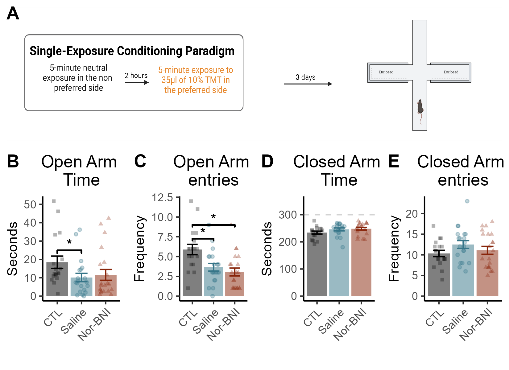

# Elevated Plus Maze

```{r,setup,include=FALSE}

knitr::opts_chunk$set(echo = FALSE,message=FALSE,warning=FALSE)

library(tidyverse)
library(ggpubr)
library(reshape2)
library(png)
library(rstatix)
```

```{r}
# Get GP EPM data
data <- read_csv("Data/EPM.csv")
data$Drug <- as.character(data$Drug)
data$Drug <- factor(data$Drug, levels=c("CTL","Saline","Nor-BNI"))

data$exp_index <- (data$Open_Tm*data$Open_Freq) / (data$Closed_Tm*data$Closed_Freq)
```

```{r}
# Time in the open arm
a <- data %>%
  group_by(Drug) %>%
  summarize(
    n=n(),
    mean=mean(Open_Tm),
    sd=sd(Open_Tm)
  ) %>% mutate(se=sd/sqrt(n-1)) %>%
  ggplot(aes(x=Drug,y=mean,colour=Drug,fill=Drug))+
  geom_bar(stat="identity",alpha=0.5,colour=NA)+
  geom_errorbar(aes(x=Drug,ymin=mean-se,ymax=mean+se),width=0.5)+
  scale_colour_manual(values=c("#000000", "#367588","#88250A"))+
  scale_fill_manual(values=c("#000000", "#367588","#88250A"))+
  theme_classic()+
  theme(plot.title=element_text(hjust=0.5))+
  theme(legend.position = "none")+
  theme(axis.text.x = element_text(angle = 45, vjust = 1, hjust=1))+
  labs(x="",
       y="Seconds",
       title="Open Arm \nTime")

A <- a + geom_jitter(data=data,aes(x=Drug,y=Open_Tm,shape=Drug),size=1,alpha=0.3,width=0.25,height=0)+
  scale_shape_manual(values = c("square","circle","triangle"))+
  geom_signif(data=data,
              aes(y_position=25,xmin=1,xmax=2,
              annotations=c("*")),manual = T,colour="black")
```

```{r}
# Time in the Closed Arm
data_2 <- data[data$Closed_Tm > 150, ]
a <- data_2 %>%
  group_by(Drug) %>%
  summarize(
    n=n(),
    mean=mean(Closed_Tm),
    sd=sd(Closed_Tm)
  ) %>% mutate(se=sd/sqrt(n-1)) %>%
  ggplot(aes(x=Drug,y=mean,colour=Drug,fill=Drug))+
  geom_bar(stat="identity",alpha=0.5,colour=NA)+
  geom_errorbar(aes(x=Drug,ymin=mean-se,ymax=mean+se),width=0.5)+
  scale_colour_manual(values=c("#000000", "#367588","#88250A"))+
  scale_fill_manual(values=c("#000000", "#367588","#88250A"))+
  theme_classic()+
  theme(plot.title=element_text(hjust=0.5))+
  theme(legend.position = "none")+
  theme(axis.text.x = element_text(angle = 45, vjust = 1, hjust=1))+
  labs(x="",
       y="Seconds",
       title="Closed Arm \nTime")+
  ylim(0,350)+
  geom_hline(yintercept=300,linetype = "dashed", colour="lightgrey")

B <- a + geom_jitter(data=data_2,aes(x=Drug,y=Closed_Tm,shape=Drug),size=1,alpha=0.3,width=0.25,height=0)+
  scale_shape_manual(values = c("square","circle","triangle"))
```

```{r}
# Number of Entries into the Open Arm
a <- data %>%
  group_by(Drug) %>%
  summarize(
    n=n(),
    mean=mean(Open_Freq),
    sd=sd(Open_Freq)
  ) %>% mutate(se=sd/sqrt(n-1)) %>%
  ggplot(aes(x=Drug,y=mean,colour=Drug,fill=Drug))+
  geom_bar(stat="identity",alpha=0.5,colour=NA)+
  geom_errorbar(aes(x=Drug,ymin=mean-se,ymax=mean+se),width=0.5)+
  scale_colour_manual(values=c("#000000", "#367588","#88250A"))+
  scale_fill_manual(values=c("#000000", "#367588","#88250A"))+
  theme_classic()+
  theme(plot.title=element_text(hjust=0.5))+
  theme(legend.position = "none")+
  theme(axis.text.x = element_text(angle = 45, vjust = 1, hjust=1))+
  labs(x="",
       y="Frequency",
       title="Open Arm \nentries")

C <- a + geom_jitter(data=data,aes(x=Drug,y=Open_Freq,shape=Drug),size=1,alpha=0.3,width=0.25,height=0)+
  scale_shape_manual(values = c("square","circle","triangle"))+
  geom_signif(data=data,
              aes(y_position=9,xmin=1,xmax=3,
              annotations=c("*")),tip_length=0.02,manual = T,colour="black")+
  geom_signif(data=data,
              aes(y_position=7.25,xmin=1,xmax=2,
              annotations=c("*")),tip_length=0.02,manual = T,colour="black")
```

```{r}
# Number of Entries into the Closed Arms
a <- data %>%
  group_by(Drug) %>%
  summarize(
    n=n(),
    mean=mean(Closed_Freq),
    sd=sd(Closed_Freq)
  ) %>% mutate(se=sd/sqrt(n-1)) %>%
  ggplot(aes(x=Drug,y=mean,colour=Drug,fill=Drug))+
  geom_bar(stat="identity",alpha=0.5,colour=NA)+
  geom_errorbar(aes(x=Drug,ymin=mean-se,ymax=mean+se),width=0.5)+
  scale_colour_manual(values=c("#000000", "#367588","#88250A"))+
  scale_fill_manual(values=c("#000000", "#367588","#88250A"))+
  theme_classic()+
  theme(plot.title=element_text(hjust=0.5))+
  theme(legend.position = "none")+
  theme(axis.text.x = element_text(angle = 45, vjust = 1, hjust=1))+
  labs(x="",
       y="Frequency",
       title="Closed Arm \nentries")

D <- a + geom_jitter(data=data,aes(x=Drug,y=Closed_Freq,shape=Drug),size=1,alpha=0.3,width=0.25,height=0)+
  scale_shape_manual(values = c("square","circle","triangle"))
```

```{r}
# Exploratory Drive ""

a <- data %>%
  mutate(sqrt = sqrt(exp_index))

b <- a %>%
  group_by(Drug) %>%
  summarize(
    n=n(),
    mean=mean(sqrt),
    sd=sd(sqrt)
  ) %>% mutate(se=sd/sqrt(n-1)) %>%
  ggplot(aes(x=Drug,y=mean,colour=Drug,fill=Drug))+
  geom_bar(stat="identity",alpha=0.5,colour=NA)+
  geom_errorbar(aes(x=Drug,ymin=mean-se,ymax=mean+se),width=0.5)+
  scale_colour_manual(values=c("#000000", "#367588","#88250A"))+
  scale_fill_manual(values=c("#000000", "#367588","#88250A"))+
  theme_classic()+
  theme(plot.title=element_text(hjust=0.5))+
  theme(legend.position = "none")+
  theme(axis.text.x = element_text(angle = 45, vjust = 1, hjust=1))+
  labs(x="",
       y="Frequency",
       title="Closed Arm \nentries")

X <- b + geom_jitter(data=a,aes(x=Drug,y=sqrt,shape=Drug),size=1,alpha=0.3,width=0.25,height=0)+
  scale_shape_manual(values = c("square","circle","triangle"))
```


```{r}
# FOUR PAWS
a <- data %>%
  group_by(Drug) %>%
  summarize(
    n=n(),
    mean=mean(FourPaws_Freq),
    sd=sd(FourPaws_Freq)
  ) %>% mutate(se=sd/sqrt(n-1)) %>%
  ggplot(aes(x=Drug,y=mean,colour=Drug,fill=Drug))+
  geom_bar(stat="identity",alpha=0.5,colour=NA)+
  geom_errorbar(aes(x=Drug,ymin=mean-se,ymax=mean+se),width=0.5)+
  scale_colour_manual(values=c("#000000", "#367588","#88250A"))+
  scale_fill_manual(values=c("#000000", "#367588","#88250A"))+
  theme_classic()+
  theme(plot.title=element_text(hjust=0.5))+
  theme(legend.position = "none")+
  theme(axis.text.x = element_text(angle = 45, vjust = 1, hjust=1))+
  labs(x="",
       y="Frequency",
       title="Four Paws in\n the Open Arm")

E <- a + geom_jitter(data=data,aes(x=Drug,y=FourPaws_Freq,shape=Drug),size=3,alpha=0.3,width=0.25,height=0)+
  scale_shape_manual(values = c("square","circle","triangle"))
```

```{r}
# "HEAD DIPS"
a <- data %>%
  group_by(Drug) %>%
  summarize(
    n=n(),
    mean=mean(HeadDip_Freq),
    sd=sd(HeadDip_Freq)
  ) %>% mutate(se=sd/sqrt(n-1)) %>%
  ggplot(aes(x=Drug,y=mean,colour=Drug,fill=Drug))+
  geom_bar(stat="identity",alpha=0.5,colour=NA)+
  geom_errorbar(aes(x=Drug,ymin=mean-se,ymax=mean+se),width=0.5)+
  scale_colour_manual(values=c("#000000", "#367588","#88250A"))+
  scale_fill_manual(values=c("#000000", "#367588","#88250A"))+
  theme_classic()+
  theme(plot.title=element_text(hjust=0.5))+
  theme(legend.position = "none")+
  theme(axis.text.x = element_text(angle = 45, vjust = 1, hjust=1))+
  labs(x="",
       y="Frequency",
       title="Risk \nAssessments")

F <- a + geom_jitter(data=data,aes(x=Drug,y=HeadDip_Freq,shape=Drug),size=1,alpha=0.3,width=0.25,height=0)+
  scale_shape_manual(values = c("square","circle","triangle"))
```

```{r}
# REARING 
a <- data %>%
  group_by(Drug) %>%
  summarize(
    n=n(),
    mean=mean(Rear_Tm),
    sd=sd(Rear_Tm)
  ) %>% mutate(se=sd/sqrt(n-1)) %>%
  ggplot(aes(x=Drug,y=mean,colour=Drug,fill=Drug))+
  geom_bar(stat="identity",alpha=0.5,colour=NA)+
  geom_errorbar(aes(x=Drug,ymin=mean-se,ymax=mean+se),width=0.5)+
  scale_colour_manual(values=c("#000000", "#367588","#88250A"))+
  scale_fill_manual(values=c("#000000", "#367588","#88250A"))+
  theme_classic()+
  theme(plot.title=element_text(hjust=0.5))+
  theme(legend.position = "none")+
  theme(axis.text.x = element_text(angle = 45, vjust = 1, hjust=1))+
  labs(x="",
       y="Seconds",
       title="Rearing")

G <- a + geom_jitter(data=data,aes(x=Drug,y=Rear_Tm,shape=Drug),size=3,alpha=0.3,width=0.25,height=0)+
  scale_shape_manual(values = c("square","circle","triangle"))

a <- data %>%
  group_by(Drug) %>%
  summarize(
    n=n(),
    mean=mean(Rear_Freq),
    sd=sd(Rear_Freq)
  ) %>% mutate(se=sd/sqrt(n-1)) %>%
  ggplot(aes(x=Drug,y=mean,colour=Drug,fill=Drug))+
  geom_bar(stat="identity",alpha=0.5,colour=NA)+
  geom_errorbar(aes(x=Drug,ymin=mean-se,ymax=mean+se),width=0.5)+
  scale_colour_manual(values=c("#000000", "#367588","#88250A"))+
  scale_fill_manual(values=c("#000000", "#367588","#88250A"))+
  theme_classic()+
  theme(axis.text.x = element_text(angle = 45, vjust = 1, hjust=1))+
  theme(legend.position = "none")

b <- a + geom_jitter(data=data,aes(x=Drug,y=Rear_Freq,shape=Drug),size=1,alpha=0.3,width=0.25,height=0)+
  scale_shape_manual(values = c("square","circle","triangle"))

```

```{r}
# GROOMING
a <- data %>%
  group_by(Drug) %>%
  summarize(
    n=n(),
    mean=mean(Groom_Tm),
    sd=sd(Groom_Tm)
  ) %>% mutate(se=sd/sqrt(n-1)) %>% 
  ggplot(aes(x=Drug,y=mean,colour=Drug,fill=Drug))+
  geom_bar(stat="identity",alpha=0.5,colour=NA)+
  geom_errorbar(aes(x=Drug,ymin=mean-se,ymax=mean+se),width=0.5)+
  scale_colour_manual(values=c("#000000", "#367588","#88250A"))+
  scale_fill_manual(values=c("#000000", "#367588","#88250A"))+
  theme_classic()+
  theme(plot.title=element_text(hjust=0.5))+
  theme(legend.position = "none")+
  theme(axis.text.x = element_text(angle = 45, vjust = 1, hjust=1))+
  labs(x="",
       y="Seconds",
       title="Grooming")

H <- a + geom_jitter(data=data,aes(x=Drug,y=Groom_Tm,shape=Drug),size=3,alpha=0.3,width=0.25,height=0)+
  scale_shape_manual(values = c("square","circle","triangle"))

a <- data %>%
  group_by(Drug) %>%
  summarize(
    n=n(),
    mean=mean(Groom_Freq),
    sd=sd(Groom_Freq)
  ) %>% mutate(se=sd/sqrt(n-1)) %>%
  ggplot(aes(x=Drug,y=mean,colour=Drug,fill=Drug))+
  geom_bar(stat="identity",alpha=0.5,colour=NA)+
  geom_errorbar(aes(x=Drug,ymin=mean-se,ymax=mean+se),width=0.5)+
  scale_colour_manual(values=c("#000000", "#367588","#88250A"))+
  scale_fill_manual(values=c("#000000", "#367588","#88250A"))+
  theme_classic()

b <- a + geom_jitter(data=data,aes(x=Drug,y=Groom_Freq,shape=Drug),size=1,alpha=0.5,width=0.25,height=0)+
  scale_shape_manual(values = c("square","circle","triangle"))
```

```{r}
# Generate Panel
cartoon <- readPNG("Cartoons/EPM_timeline.png")
AA <- ggplot () + 
  background_image(cartoon)+
  coord_fixed(0.27)

panel <- ggarrange(A,C,B,D,
          
          nrow=1,ncol=4,
          labels=c("B","C","D","E"
                   ))

panel_2 <- ggarrange(AA,panel,
                     nrow=2,ncol=1,
                     heights=c(2,3),
                     labels=("A"))

panel_2 <- panel_2 +
  theme(panel.background = element_rect(fill="#FFFFFF",colour="#FFFFFF"))+
  theme(plot.background = element_rect(fill = "#FFFFFF", colour="#FFFFFF"))

ggsave("Panels/4_EPM_panel.png",panel_2,height=4, width=5.5,dpi=300)
ggsave("Panels/tiffs/4_EPM_panel.tiff",panel_2,height=4,width=5.5,dpi=500,device=tiff)
```

```{r}

```

## Statistical Analyses

One-way ANOVA on time spent in the open arm indicated a significant effect of group (F(1,57) = 4.78, p = 0.03). 

```{r}
# Time in the open arm (seconds)

# Run Oneway ANOVA
a <-oneway.test(Open_Tm ~ TMT, data = data, var.equal = TRUE)
get_anova_table(a)

# Run follow-up Comparisons 
c <- data %>%
  pairwise_t_test(
  Open_Tm ~ Drug, paired = FALSE,
  p.adjust.method = "bonferroni"
  )

knitr::kable(c)
```

One-way ANOVA on time the number of entries into the open arm indicated a significant effect of group (F(1,57) = 14.78, p < 0.001)

```{r}
# Number of entries in to the open arm 

# Run Oneway ANOVA
oneway.test(Open_Freq ~ TMT, data = data, var.equal = TRUE)
get_anova_table(a)

# Run follow-up comparisons
c <- data %>%
  pairwise_t_test(
  Open_Freq ~ Drug, paired = FALSE,
  p.adjust.method = "bonferroni"
  )

knitr::kable(c)
```

Follow-up pairwise comparisons indicated that CTL mice made more entries into the open arms than TMT+Saline (p = 0.005) or TMT+NorBNI (p < 0.001) mice, and that there was no effect of NorBNI treatment among TMT-exposed mice (p = 0.41)

There were no differences in time spent in the closed arms or number of enteries into the closed arms. 

```{r}
# Time spent in to the closed arm (seconds)

# Run Oneway ANOVA
oneway.test(Closed_Tm ~ TMT, data = data, var.equal = TRUE)
get_anova_table(a)

# Run follow-up comparisons
c <- data %>%
  pairwise_t_test(
  Closed_Tm ~ Drug, paired = FALSE,
  p.adjust.method = "bonferroni"
  )

knitr::kable(c)

# Enteries into the closed arm (number)

# Run Oneway ANOVA
oneway.test(Closed_Freq ~ TMT, data = data, var.equal = TRUE)
get_anova_table(a)

# Run follow-up comparisons
c <- data %>%
  pairwise_t_test(
  Closed_Freq ~ Drug, paired = FALSE,
  p.adjust.method = "bonferroni"
  )

knitr::kable(c)
```


