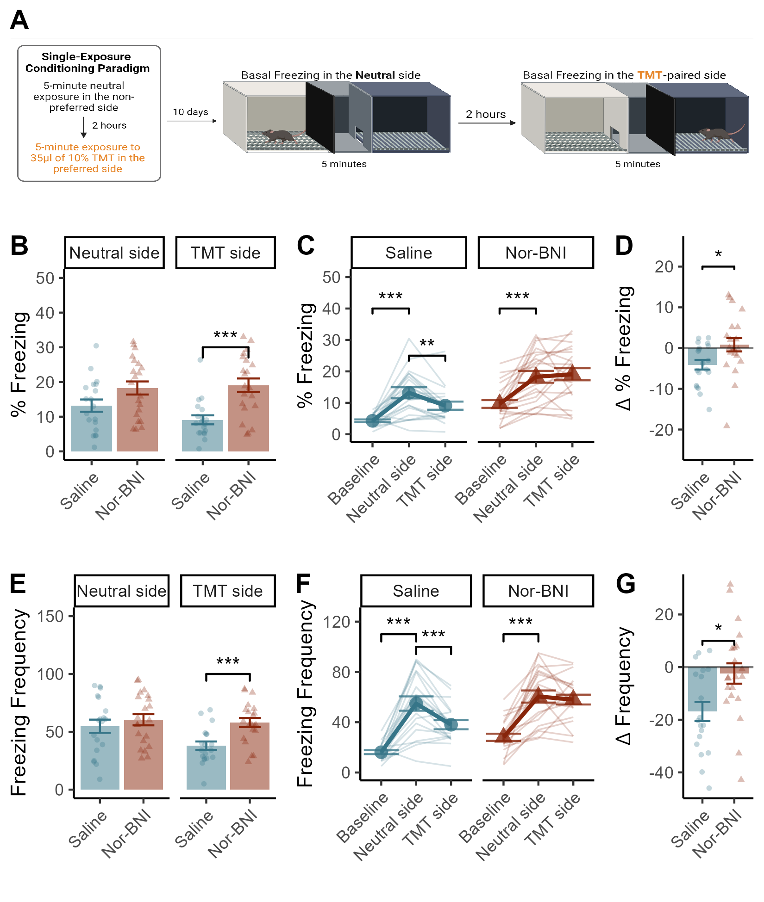

# Basal Freezing Long After TMT

```{r,setup,include=FALSE}
knitr::opts_chunk$set(echo = FALSE,message=FALSE,warning=FALSE)

## Load Packages
library(tidyverse)
library(ggpubr)
library(reshape2)
library(png)
library(rstatix)
```

```{r}
# Get long after freezing data
TwoWeeksFrz_data <- read_csv("Data/Long_Frz.csv")
TwoWeeksFrz_data$Drug <- as.character(TwoWeeksFrz_data$Drug)
TwoWeeksFrz_data$Drug <- factor(TwoWeeksFrz_data$Drug, levels = unique(TwoWeeksFrz_data$Drug))

train_data <- read_csv("Data/H2O_TMT_Exposures.csv")
train_data$Perc <- (train_data$Frz_Tm / 250)*100

train_data$Drug <- as.character(train_data$Drug)
train_data$Drug <- factor(train_data$Drug, levels = unique(train_data$Drug))

train_data <- train_data %>% 
  mutate(Av_Dur = Frz_Tm / Frz_Freq)
  
train_data$Task <- case_match(train_data$Task,
           "Neutral" ~ "Baseline",
           "Neutral side" ~ "Neutral side",
           "TMT side" ~ "TMT side")

ALL_frz_Data <- rbind(train_data,TwoWeeksFrz_data)
ALL_frz_Data$Task <- as.character(ALL_frz_Data$Task)
ALL_frz_Data$Task <- factor(ALL_frz_Data$Task,levels=c("Baseline","TMT","TMT side","Neutral side"))
OG_baseline_data <- train_data[train_data$Task == "Baseline", ]
All_baseline_data <- rbind(OG_baseline_data, TwoWeeksFrz_data) %>%
  filter(ID != 35)

TwoWeeksFrz_data <- TwoWeeksFrz_data %>%
  filter(ID != 35)
```

```{r}
# Time Spent Freezing (Percent)
a <- TwoWeeksFrz_data %>%
  group_by(Drug,Task)%>%
  summarise(
    n=n(),
    mean=mean(Perc),
    sd=sd(Perc)
  ) %>% 
  mutate(se=sd/sqrt(n)) %>%
  ggplot(aes(x=Drug,y=mean,colour=Drug,fill=Drug))+
  geom_bar(stat="identity",alpha=0.5,colour=NA)+
  geom_errorbar(aes(x=Drug,ymin=mean-se,ymax=mean+se),width=0.5)+
  scale_colour_manual(values=c("#367588","#88250A"))+
  scale_fill_manual(values=c("#367588","#88250A"))+
  theme_classic()+
  facet_wrap(~Task,ncol=4)+
  theme(plot.title=element_text(hjust=0.5))+
  theme(legend.position = "none")+
  theme(axis.text.x = element_text(angle = 45, hjust=1))+
  labs(x="",
       y="% Freezing")+
  ylim(0,50)

x <- data.frame(Drug = c("Saline","Saline"),
                Task = c("Neutral side","TMT side"),
                end = c("Nor-BNI","Nor-BNI"),
                y = c(100,30),
                label = c("p=0.06","***"))

x$Drug <- as.character(x$Drug)
x$Drug <- factor(x$Drug,labels=unique(x$Drug))

A <- a +
  geom_jitter(data = TwoWeeksFrz_data, aes(x=Drug,y=Perc,shape=Drug),size=1,alpha=0.3,width=0.15,height=0)+ 
  geom_signif(data = x, 
              aes(xmin = Drug, xmax = end, annotations = label, y_position = y),colour="black",manual = TRUE)

b <- All_baseline_data %>%
  group_by(Drug,Task)%>%
  summarise(
    n=n(),
    mean=mean(Perc),
    sd=sd(Perc)
  ) %>% 
  mutate(se=sd/sqrt(n)) %>%
  ggplot(aes(x=Task,y=mean,group=Drug,shape=Drug,colour=Drug,group=Drug))+
  geom_point(size=3,alpha=0.8)+
  geom_line(size=1)+
  geom_errorbar(aes(x=Task,ymin=mean-se,ymax=mean+se),width=1,alpha=0.8)+
  scale_colour_manual(values=c("#367588","#88250A"))+
  facet_wrap(~Drug)+
  theme_classic()+
  theme(legend.position="none")+
  theme(axis.text.x = element_text(angle = 45, hjust=1))+
  theme(axis.text.x = element_text(angle = 45, hjust=1))+
  labs(x="",y="% Freezing")+
  ylim(0,50)

x <- data.frame(Task = c("Baseline","Baseline"),
                Drug = c("Saline","Nor-BNI"),
                end = c("Neutral side","Neutral side"),
                y = c(40,40),
                label = c("***","***"))

y <- data.frame(Task = c("Neutral side","Neutral side"),
                Drug = c("Saline","Nor-BNI"),
                end = c("TMT side","TMT side"),
                y = c(55,25),
                label = c("n.s.","**"))

x$Drug <- as.character(x$Drug)
x$Drug <- factor(x$Drug,labels=unique(x$Drug))

y$Drug <- as.character(x$Drug)
y$Drug <- factor(y$Drug,labels=unique(y$Drug))

B <- b +
  geom_line(data=All_baseline_data, aes(x=Task,y=Perc,group=ID,colour=Drug),size=0.4,alpha=0.2)+
  scale_colour_manual(values=c("#367588","#88250A"))+ 
  geom_signif(data = x, 
              aes(xmin = Task, xmax = end, annotations = label, y_position = y),colour="black",manual = TRUE)+ 
  geom_signif(data = y, 
              aes(xmin = Task, xmax = end, annotations = label, y_position = y),colour="black",manual = TRUE)

c <- All_baseline_data %>%
  filter(Task != "Baseline") %>%
  select("ID","Task","Expt","Drug","Perc") %>%
  dcast(ID+Drug~Task) %>%
  mutate(change = `TMT side` - `Neutral side`) %>%
  filter(change <45)

C <- c %>%
  group_by(Drug) %>%
  summarise(
    n=n(),
    mean=mean(change),
    sd=sd(change)
  ) %>% mutate(se = sd / sqrt(n)) %>%
  ggplot(aes(x=Drug,y=mean,colour=Drug,fill=Drug))+
  geom_bar(stat="identity",alpha=0.5,colour=NA)+
  geom_errorbar(aes(x=Drug,ymin=mean-se,ymax=mean+se),width=0.5)+
  scale_colour_manual(values=c("#367588","#88250A"))+
  scale_fill_manual(values=c("#367588","#88250A"))+
  theme_classic()+
  theme(legend.position = "none")+
  theme(axis.text.x = element_text(angle = 45, hjust=1))+
  labs(x="",y=expression(Delta~"% Freezing"))+
  geom_jitter(data=c,aes(x=Drug,y=change,shape=Drug),size=1,alpha=0.3,width=0.25)+
  geom_hline(yintercept=0,alpha=0.5)+
  geom_signif(y_position=20,xmin=1,xmax=2,
              annotations="*",tip_length=0.02,colour="black")+
  ylim(-25,25)
```

```{r}
# Number of freezes 
a <- TwoWeeksFrz_data %>%
  group_by(Drug,Task)%>%
  summarise(
    n=n(),
    mean=mean(Frz_Freq),
    sd=sd(Frz_Freq)
  ) %>% 
  mutate(se=sd/sqrt(n)) %>%
  ggplot(aes(x=Drug,y=mean,colour=Drug,fill=Drug))+
  geom_bar(stat="identity",alpha=0.5,colour=NA)+
  geom_errorbar(aes(x=Drug,ymin=mean-se,ymax=mean+se),width=0.5)+
  scale_colour_manual(values=c("#367588","#88250A"))+
  scale_fill_manual(values=c("#367588","#88250A"))+
  theme_classic()+
  facet_wrap(~Task,ncol=4)+
  theme(plot.title=element_text(hjust=0.5))+
  theme(legend.position = "none")+
  theme(axis.text.x = element_text(angle = 45, hjust=1))+
  labs(x="",
       y="Freezing Frequency")+
  ylim(0,150)

x <- data.frame(Drug = c("Saline","Saline"),
                Task = c("Neutral side","TMT side"),
                end = c("Nor-BNI","Nor-BNI"),
                y = c(200,100),
                label = c("n.s.","***"))

x$Drug <- as.character(x$Drug)
x$Drug <- factor(x$Drug,labels=unique(x$Drug))

D <- a + geom_jitter(data = TwoWeeksFrz_data, aes(x=Drug,y=Frz_Freq,shape=Drug),size=1,alpha=0.3,width=0.15,height=0)+ 
  geom_signif(data = x, 
              aes(xmin = Drug, xmax = end, annotations = label, y_position = y),colour="black",manual = TRUE)

e <- All_baseline_data %>%
  group_by(Drug,Task)%>%
  summarise(
    n=n(),
    mean=mean(Frz_Freq),
    sd=sd(Frz_Freq)
  ) %>% 
  mutate(se=sd/sqrt(n)) %>%
  ggplot(aes(x=Task,y=mean,group=Drug,shape=Drug,colour=Drug,group=Drug))+
  geom_point(size=3,alpha=0.8)+
  geom_line(size=1)+
  geom_errorbar(aes(x=Task,ymin=mean-se,ymax=mean+se),width=1,alpha=0.8)+
  scale_colour_manual(values=c("#367588","#88250A"))+
  facet_wrap(~Drug)+
  theme_classic()+
  theme(legend.position="none")+
  theme(axis.text.x = element_text(angle = 45, hjust=1))+
  labs(x="",y="Freezing Frequency")+
  ylim(0,125)


x <- data.frame(Task = c("Baseline","Baseline"),
                Drug = c("Saline","Nor-BNI"),
                end = c("Neutral side","Neutral side"),
                y = c(110,110),
                label = c("***","***"))

y <- data.frame(Task = c("Neutral side","Neutral side"),
                Drug = c("Saline","Nor-BNI"),
                end = c("TMT side","TMT side"),
                y = c(200,100),
                label = c("n.s.","***"))

x$Drug <- as.character(x$Drug)
x$Drug <- factor(x$Drug,labels=unique(x$Drug))

y$Drug <- as.character(x$Drug)
y$Drug <- factor(y$Drug,labels=unique(y$Drug))

E <- e +
  geom_line(data=All_baseline_data, aes(x=Task,y=Frz_Freq,group=ID,colour=Drug),size=0.4,alpha=0.2)+
  scale_colour_manual(values=c("#367588","#88250A"))+ 
  geom_signif(data = x, 
              aes(xmin = Task, xmax = end, annotations = label, y_position = y),colour="black",manual = TRUE)+ 
  geom_signif(data = y, 
              aes(xmin = Task, xmax = end, annotations = label, y_position = y),colour="black",manual = TRUE)


OG_baseline_data <- train_data[train_data$Task == "Baseline", ]
All_baseline_data <- rbind(OG_baseline_data, TwoWeeksFrz_data)

c <- All_baseline_data %>%
  filter(Task != "Baseline") %>%
  select("ID","Task","Expt","Drug","Frz_Freq") %>%
  dcast(ID+Drug~Task) %>%
  mutate(change = `TMT side` - `Neutral side`) %>%
  filter(change <35)

F <- c %>%
  group_by(Drug) %>%
  summarise(
    n=n(),
    mean=mean(change),
    sd=sd(change)
  ) %>% mutate(se = sd / sqrt(n)) %>%
  ggplot(aes(x=Drug,y=mean,colour=Drug,fill=Drug))+
  geom_bar(stat="identity",alpha=0.5,colour=NA)+
  geom_errorbar(aes(x=Drug,ymin=mean-se,ymax=mean+se),width=0.5)+
  scale_colour_manual(values=c("#367588","#88250A"))+
  scale_fill_manual(values=c("#367588","#88250A"))+
  theme_classic()+
  theme(legend.position = "none")+
  theme(axis.text.x = element_text(angle = 45, hjust=1))+
  labs(x="",y=expression(Delta~"Frequency"))+
  geom_jitter(data=c,aes(x=Drug,y=change,shape=Drug),size=1,alpha=0.3,width=0.25)+
  geom_hline(yintercept=0,alpha=0.5)+
  geom_signif(y_position=10,xmin=1,xmax=2,
              annotations="*",tip_length=0.02,colour="black")
```

```{r}
# Average Duation
a <- TwoWeeksFrz_data %>%
  group_by(Drug,Task)%>%
  summarise(
    n=n(),
    mean=mean(Av_Dur),
    sd=sd(Av_Dur)
  ) %>% 
  mutate(se=sd/sqrt(n)) %>%
  ggplot(aes(x=Drug,y=mean,colour=Drug,fill=Drug))+
  geom_bar(stat="identity",alpha=0.5,colour=NA)+
  geom_errorbar(aes(x=Drug,ymin=mean-se,ymax=mean+se),width=0.5)+
  scale_colour_manual(values=c("#367588","#88250A"))+
  scale_fill_manual(values=c("#367588","#88250A"))+
  theme_classic()+
  facet_wrap(~Task,ncol=4)+
  theme(plot.title=element_text(hjust=0.5))+
  theme(legend.position = "none")+
  theme(axis.text.x = element_text(angle = 45, hjust=1))+
  labs(x="",
       y="Average Freeze (s)")+
  ylim(0,2)

x <- data.frame(Drug = c("Saline","Saline"),
                Task = c("Neutral side","TMT side"),
                end = c("Nor-BNI","Nor-BNI"),
                y = c(1.5,1.5),
                label = c("***","***"))

x$Drug <- as.character(x$Drug)
x$Drug <- factor(x$Drug,labels=unique(x$Drug))

G <- a + geom_jitter(data = TwoWeeksFrz_data, aes(x=Drug,y=Av_Dur,shape=Drug),size=1,alpha=0.3,width=0.15,height=0)+ 
  geom_signif(data = x, 
              aes(xmin = Drug, xmax = end, annotations = label, y_position = y),colour="black",manual = TRUE)

e <- All_baseline_data %>%
  group_by(Drug,Task)%>%
  summarise(
    n=n(),
    mean=mean(Av_Dur),
    sd=sd(Av_Dur)
  ) %>% 
  mutate(se=sd/sqrt(n)) %>%
  ggplot(aes(x=Task,y=mean,group=Drug,shape=Drug,colour=Drug,group=Drug))+
  geom_point(size=3,alpha=0.8)+
  geom_line(size=1)+
  geom_errorbar(aes(x=Task,ymin=mean-se,ymax=mean+se),width=1,alpha=0.8)+
  scale_colour_manual(values=c("#367588","#88250A"))+
  facet_wrap(~Drug)+
  theme_classic()+
  theme(legend.position="none")+
  theme(axis.text.x = element_text(angle = 45, hjust=1))+
  labs(x="",y="Average Freeze (s)")+
  ylim(0,2)

H <- e +
  geom_line(data=All_baseline_data, aes(x=Task,y=Av_Dur,group=ID,colour=Drug),size=0.4,alpha=0.2)+
  scale_colour_manual(values=c("#367588","#88250A"))

OG_baseline_data <- train_data[train_data$Task == "Baseline", ]
All_baseline_data <- rbind(OG_baseline_data, TwoWeeksFrz_data)

c <- All_baseline_data %>%
  filter(Task != "Baseline") %>%
  select("ID","Task","Expt","Drug","Av_Dur") %>%
  dcast(ID+Drug~Task) %>%
  mutate(change = `TMT side` - `Neutral side`) %>%
  filter(change <35)

I <- c %>%
  group_by(Drug) %>%
  summarise(
    n=n(),
    mean=mean(change),
    sd=sd(change)
  ) %>% mutate(se = sd / sqrt(n)) %>%
  ggplot(aes(x=Drug,y=mean,colour=Drug,fill=Drug))+
  geom_bar(stat="identity",alpha=0.5,colour=NA)+
  geom_errorbar(aes(x=Drug,ymin=mean-se,ymax=mean+se),width=0.5)+
  scale_colour_manual(values=c("#367588","#88250A"))+
  scale_fill_manual(values=c("#367588","#88250A"))+
  theme_classic()+
  theme(legend.position = "none")+
  theme(axis.text.x = element_text(angle = 45, hjust=1))+
  labs(x="",y=expression(Delta~"Average Freeze (s)"))+
  geom_jitter(data=c,aes(x=Drug,y=change,shape=Drug),size=1,alpha=0.3,width=0.25)+
  geom_hline(yintercept=0,alpha=0.5)+
  geom_signif(y_position=2,xmin=1,xmax=2,
              annotations="*",tip_length=0.02,colour="black")+
  ylim(-0.5,0.5)
```

```{r}
# Correlations 
J <- TwoWeeksFrz_data %>%
  group_by(Drug) %>%
  ggplot(aes(x=Frz_Freq,y=Perc,colour=Drug,shape=Drug,fill=Drug))+
  geom_point(size=5,alpha=0.5,colour=NA)+
  geom_smooth(method="lm",alpha=0.5)+
  scale_colour_manual(values=c("#367588","#88250A"))+
  scale_fill_manual(values=c("#367588","#88250A"))+
  facet_wrap(~Task)+
  theme_classic()+
  theme(legend.position=c(0,1),legend.justification = c(0,1))+
  labs(x="Freezing Frequency",
       y="% Freezing",
       colour=NULL,shape=NULL,fill=NULL)+
  ylim(0,70)

K <- TwoWeeksFrz_data %>%
  group_by(Drug) %>%
  ggplot(aes(x=Av_Dur,y=Perc,colour=Drug,shape=Drug,fill=Drug))+
  geom_point(size=5,alpha=0.5,colour=NA)+
  geom_smooth(method="lm",alpha=0.5)+
  scale_colour_manual(values=c("#367588","#88250A"))+
  scale_fill_manual(values=c("#367588","#88250A"))+
  facet_wrap(~Task)+
  theme_classic()+
  theme(legend.position=c(0,1),legend.justification = c(0,1))+
  labs(x="Average Duration of Freezing Episode (s)",
       y="% Freezing",
       colour=NULL,shape=NULL,fill=NULL)+
  ylim(0,70)
```

```{r}
cartoon <- readPNG("Cartoons/GPs_LONG.png")
AA <- ggplot () + 
  background_image(cartoon)+
  coord_fixed(0.2)

BB <- ggplot()+
  theme_void()


top <- ggarrange(A,B,C,
                 nrow=1,ncol=3,
                 labels = c("B","C","D"),
                 widths = c(0.9,1,0.5))

middle <- ggarrange(D,E,F,
                    nrow=1,ncol=3,
                    labels=c("E","F","G"),
                    widths = c(0.9,1,0.5))

panel <- ggarrange(AA,top,middle,
          nrow=3,ncol=1,heights=c(2,3,3,3),
          labels=c("A"))+
  theme(panel.background = element_rect(fill="#FFFFFF",colour="#FFFFFF"))+
  theme(plot.background = element_rect(fill = "#FFFFFF", colour="#FFFFFF"))


ggsave("Panels/5_Long_Panel.png",panel,height=6.5,width=5.5,dpi=300)
ggsave("Panels/tiffs/5_Long_panel.tiff",panel,height=6.5,width=5.5,dpi=500,device=tiff)
```

```{r, fig.cap="Timeline of experimental proceedings: 10 days after the single 5-minute exposure to 10% TMT, mice were placed in each side of the conditioning apparatus for 5 minutes and basal levels of freezing were measured (A). Nor-BNI injected mice froze more than saline mice on the TMT-paired side, but not on the neutral side (B). Both drug conditions exhibited a robust increase in freezing relative to their baseline data from 10 days earlier (C). Saline mice decreased freezing between the two sessions whereas NorBNI-treated mice did not (C). The change in freezing behaviour between the two sessions was significantly reduced by NorBNI administration (D). The frequency of freezing was significantly higher for NorBNI injected mice on the TMT-paried side, but not the neutral side (E). Saline but not NorBNI injected mice reduced the frequency of freezing between the two sessions (F). The magnitude of the change between the two sessions was significantly reduced by NorBNI (G). Data presented as mean +/- SEM, * p < 0.05, ** p < 0.01, *** p < 0.001. "}

```

## Statistical Analyses

### Time Spent Freezing

We computed a 2x2 ANOVA with side (Neutral or TMT-paired) as the within subjects factor and Drug condition (Saline or NorBNI) as the between groups factor. This model indicated a significant side * Drug interaction (F(1,38) = 5.69, p = 0.02)

```{r}
# Analyze Time spent freezing (percent) first
c <- All_baseline_data %>%
  filter(Task != "Baseline") %>%
  select("ID","Task","Expt","Drug","Frz_Tm") %>%
  dcast(ID+Drug~Task) %>%
  mutate(change = `TMT side` - `Neutral side`) 


d <- c %>%
  select("ID","Drug",`Neutral side`, `TMT side`) %>%
  melt(id.vars=(c("ID","Drug")))

a <- anova_test(data=d, dv=value, wid=ID, within = variable, between = Drug)
knitr::kable(get_anova_table(a))
```

Follow-up comparisons of the significant interaction indicated that the difference in time spent freezing between Saline and Nor-BNI treated mice was not significant on the neutral size (p = 0.059), but Nor-BNI injected mice spent significantly more time freezing in the the TMT-paired compartment (p < 0.001).

```{r, Follow_ups_LONG}
e <- d %>%
  group_by(variable)%>%
  pairwise_t_test(
  value ~ Drug, paired = FALSE,
  p.adjust.method = "bonferroni"
  )

knitr::kable(e)
```

 Saline-treated mice exhibited a decrease in time spent freezing between the first and the second session of the long after test (p = 0.003) whereas TMT-treated mice did not decrease freezing between the two sessions (p =0.62).

```{r}
f <- d %>%
  group_by(Drug)%>%
  pairwise_t_test(
  value ~ variable, paired = TRUE,
  p.adjust.method = "bonferroni"
  )

knitr::kable(f)
```

Additionally, the change in freezing behaviour between the two sessions was significantly greater for Saline-treated mice than for NorBNI (t(38) = 2.43, p = 0.01)

```{r}
t.test(change~Drug,data=c)
```

### Freezing Frequency

We also computed a 2x2 ANOVA on freezing frequency, which also indicated a Drug*Timepoint interaction (F(1,38) = 7.26, p = 0.01). 

```{r}
# Analyze Time spent freezing (percent) first
c <- All_baseline_data %>%
  filter(Task != "Baseline") %>%
  select("ID","Task","Expt","Drug","Frz_Freq") %>%
  dcast(ID+Drug~Task) %>%
  mutate(change = `TMT side` - `Neutral side`) 


d <- c %>%
  select("ID","Drug",`Neutral side`, `TMT side`) %>%
  melt(id.vars=(c("ID","Drug")))

a <- anova_test(data=d, dv=value, wid=ID, within = variable, between = Drug)
knitr::kable(get_anova_table(a))
```

Follow-up comparisons of the significant interaction indicated that there was no effect of Drug treatment on the frequency of freezing on the neutral size (p = 0.45), but Nor-BNI injected mice spent significantly more time freezing than saline-treated mice in the the TMT-paired compartment (p < 0.001).

```{r}
e <- d %>%
  group_by(variable)%>%
  pairwise_t_test(
  value ~ Drug, paired = FALSE,
  p.adjust.method = "bonferroni"
  )

knitr::kable(e)
```

Saline-treated mice exhibited a decrease in the frequency of freezing between the first and the second session of the long after test (p = <0.001) whereas TMT-treated mice did not decrease freezing between the two sessions (p = 0.53).

```{r}
f <- d %>%
  group_by(Drug)%>%
  pairwise_t_test(
  value ~ variable, paired = TRUE,
  p.adjust.method = "bonferroni"
  )

knitr::kable(f)
```

Additionally, the change in freezing behaviour between the two sessions was significantly greater for Saline-treated mice than for NorBNI (t(38) = 2.71, p = 0.01)

```{r}
t.test(change~Drug,data=c)
```

### Average Duration of Freeze

Repeated measures ANOVA on the average duration of freezing episode indicated a main effect of drug only (F (1,38) = 15.71, p < 0.001).

```{r}
# Analyze Av_Dur
c <- All_baseline_data %>%
  filter(Task != "Baseline") %>%
  select("ID","Task","Expt","Drug","Av_Dur") %>%
  dcast(ID+Drug~Task) %>%
  mutate(change = `TMT side` - `Neutral side`) 


d <- c %>%
  select("ID","Drug",`Neutral side`, `TMT side`) %>%
  melt(id.vars=(c("ID","Drug")))

a <- anova_test(data=d, dv=value, wid=ID, within = variable, between = Drug)
knitr::kable(get_anova_table(a))
```

Nor-BNI treated mice exhibited a significantly higher average duration of freezing episode than did saline-injected mice on both the neutral (p = 0.001) and the TMT-paired (p < 0.001) sides of the CPA apparatus. 

```{r}
e <- d %>%
  group_by(variable)%>%
  pairwise_t_test(
  value ~ Drug, paired = FALSE,
  p.adjust.method = "bonferroni"
  )

knitr::kable(e)
```

The within-subjects change in the average duration of freezing episode between the two sessions was not significant for either NorBNI-injected (p = 0.13) or saline-injected (p = 0.96) mice.

```{r}
f <- d %>%
  group_by(Drug)%>%
  pairwise_t_test(
  value ~ variable, paired = TRUE,
  p.adjust.method = "bonferroni"
  )

knitr::kable(f)
```

### Regressions

To investigate how each the frequency and the average duration of freezing contribute to the total amount of freezing during the session, we computed regression models with either Frequency or Average duration entered as the predictor and % Freezing entered as the dependent variable. 

```{r,echo = TRUE}
# A regression model
a <- lm(Perc~Frz_Freq * Drug + Task, data=TwoWeeksFrz_data)
summary(a)

# Re-order the "drug" variable to get the intercept for the NorBNI group.
b <- TwoWeeksFrz_data
b$Drug <- as.character(b$Drug)
b$Drug <- factor(b$Drug,levels = c("Nor-BNI","Saline"))

# A different version of the same regression model
a <- lm(Perc~Frz_Freq * Drug + Task, data=b)
summary(a)
```

The first model accounted for 86% of the variability in time spent freezing (F(4,75) = 123.9, Adjusted R^2 = 0.86, p < 0.001), and indicated that Freezing frequency was a strong independent predictor of total time freezing (t(76) = 12.14, p < 0.001). The model also indicated a significant Frequency * Drug interaction (t(76) = 2.63, p = 0.01). We evaluated the simple effects to further contextualize the significant interaction. Among saline-treated mice, a 10-unit increase in freezing frequency was associated with a 3% increase in total time spent freezing whereas for NorBNI-injected mice, a 10-unit increase in frequency was associated with a 3.9% increase in freezing among Nor-BNI treated mice. In other words, there was a 30% increase in the estimated magnitude of the relationship between the frequency of freezing and total time spent freezing for mice injected with NorBNI.  

```{r,echo=TRUE}
# Model 2: X=Av_Dur, y=Perc
a <- lm(Perc~Av_Dur * Drug + Task, data=TwoWeeksFrz_data)
summary(a)
```

The second model accounted for 70% of the variability in time spent freezing (Adjusted R^2 = 0.70). The simple effects found that although average duration of freezing episode was a strong independent predictor of freezing time (t(76) = 7.03, p < 0.001), there was no interaction between this predictor and drug treatment (p = 0.56). A 0.1-second increase in the average duration of freezing episode was associated with a 3% increase in time freezing. 

I have taught this course previously at UTM (Summer 2024). 

I have been conducting independent research in lab-based settings for over 10 years. I hold a Honours BA an MA from Brock University, and I am a late-stage PhD candidate in the department of psychology at UTM. I am uniquely positioned to provide guidance to UTM students about research opportunities that are available at UTM. 
